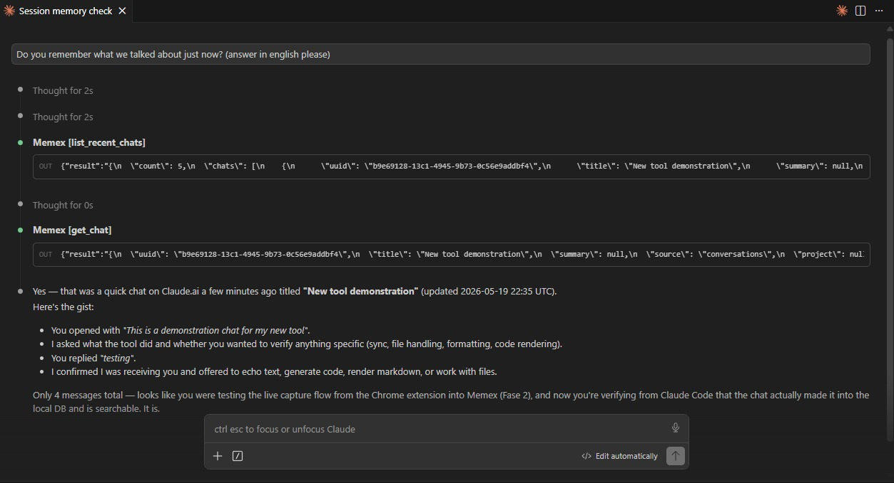

# Memex

[](https://github.com/dioniipereyraa/memex/actions/workflows/ci.yml)
[](https://opensource.org/licenses/MIT)
[](https://www.python.org/downloads/)

Local-first MCP server that indexes your Claude.ai chat history and exposes it to Claude Code (and, soon, to Claude.ai via remote MCP). The goal: give Claude Code the same context Claude.ai already has.

**Status:** alpha (`0.1.0`). Phases 0 to 3 closed. Phase 3 quality pass shipped: on-demand auto-summaries, chat ↔ project/repo association, `SessionStart` hook, and `find_related` tool. Next is Phase 5 (release polish) so an external user can install without `git clone`.



*End-to-end demo: a chat on claude.ai captured seconds earlier by the Chrome extension, recalled from Claude Code via `list_recent_chats` and `get_chat`. No extra prompting, no manual context handoff.*

## The problem

Brainstorming and planning happen in Claude.ai. Execution happens in Claude Code. The two worlds do not talk to each other: Claude Code cannot read a chat of yours from Claude.ai, not even the one that originated the task it is currently working on. The memory Anthropic shipped on Claude.ai (March 2026) is curated, not full history, and lives isolated inside Claude.ai.

Memex fills that gap: runs locally, indexes the entire corpus of your chats, and exposes them as MCP tools so Claude can search and pull past context whenever it needs to.

## How it works

```
[Claude.ai]
    ↓  (official JSON export / Chrome ext)
[Ingestor]  →  [SQLite + sqlite-vec]  →  [local embeddings (fastembed / Ollama)]
                                    ↓
                          [core: storage + retrieval]
                                    ↓
                  [MCP stdio]  ───→  Claude Code, Claude Desktop
                  [MCP SSE/HTTP] ──→ Claude.ai (coming soon)
```

Design: pure core (storage, ingest, embeddings, retrieval) decoupled from transport. The same engine serves both stdio and remote MCP without a rewrite.

## Requirements

- Python 3.12 or newer
- [uv](https://docs.astral.sh/uv/) (package manager)

Embeddings: **zero-config by default** (uses [fastembed](https://github.com/qdrant/fastembed) with a quantized 130 MB model that downloads itself the first time).

If you would rather route through your local Ollama (because you already run it for other models), set:
```bash
export MEMEX_EMBED_BACKEND=ollama
# and optionally:
ollama pull nomic-embed-text
```

## Quickstart

### Option A: install from PyPI (recommended)

```bash
# One-time install (zero-config: includes fastembed for local embeddings).
uvx --from memex-chats memex --help
# Or with pipx if you prefer:
pipx install memex-chats
```

Then:

1. Request your official Claude.ai export (Settings → Privacy → Export data).
2. Ingest it (the first run downloads the local embedding model, takes ~30s):
   ```bash
   memex ingest /path/to/your-export.zip
   ```
3. Verify the install:
   ```bash
   memex doctor
   ```
4. Search from the CLI or wire it into Claude Code (see [Wiring it into Claude Code](#wiring-it-into-claude-code) below):
   ```bash
   memex search "your query" -n 5
   memex stats
   ```

To enable the always-on live capture and the chat ↔ repo features, see the corresponding sections below.

### Option B: from source

```bash
git clone https://github.com/dioniipereyraa/memex
cd memex
uv sync
uv run memex doctor          # verify setup
uv run memex ingest data/exports/<your-export>.zip
uv run memex search "your query" -n 5
```

### Diagnostics

Run `memex doctor` any time something is not working. It checks Python version, database, embedder, live-capture server, summarizer config, registered repos, and indexed corpus. Reports OK / WARN / FAIL per check.

## MCP server tools (v1)

- `search_chats(query, limit=5, source?, mode="hybrid", repo?)` searches the corpus. Modes: `hybrid` (default, combines vector search + FTS5 BM25 via Reciprocal Rank Fusion), `semantic` (vectors only), `lexical` (FTS5 only, ideal for proper nouns or exact terms). `source` filters by origin (`conversations`, `design_chat`, `memory`). `repo` boosts results associated to a registered repo (see "Repo associations" below). Deduplicated per conversation.
- `get_chat(uuid, messages_limit=10, messages_offset=0)` fetches a conversation with its messages, paginated. `raw_content` is omitted; each message is truncated to 1500 chars to stay inside the client's token budget (worst-case response ~17k chars). Long chats are paginated with `messages_offset`; max `messages_limit` is 100.
- `list_recent_chats(limit=10, source?)` lists the latest chats ordered by last update.
- `find_related(context, limit=5, repo?)` takes free-form text (a paragraph, a file contents, the current discussion) and returns chats that are semantically related. Pure vector search, no FTS, capped at 4000 input chars. Useful when you want "more like this" without typing a keyword query.

Search is also reachable from the CLI with `memex search "query" --mode {hybrid|semantic|lexical}`. For databases created before the hybrid FTS5 work, run `memex reindex-fts` once to populate the lexical index.

## Wiring it into Claude Code

Once your local database is populated (`memex ingest`), start the MCP server with `uv run memex-mcp`. For Claude Code to discover it automatically, add a `.mcp.json` file at the root of your project (or a user-level server in `~/.claude.json`):

```json
{
  "mcpServers": {
    "memex": {
      "command": "uv",
      "args": ["run", "memex-mcp"],
      "cwd": "/absolute/path/to/the/memex/repo"
    }
  }
}
```

Set `cwd` to the absolute path where you cloned Memex (where `pyproject.toml` lives). Restart Claude Code and the tools `search_chats`, `get_chat`, `list_recent_chats` will show up in the session.

The same searches are also available from the CLI via `uv run memex search "..."` if you prefer them outside Claude Code.

## Auto-summaries (Phase 3, optional)

When `search_chats` returns a chat that does not have a summary yet, Memex can generate one on-the-fly using Claude Haiku. The summary is persisted, so the next search of the same chat hits cache and does not pay the API again. This way you only pay for chats you actually look at, not for the whole corpus.

Opt-in. Off by default. Cap: at most 3 summaries generated per `search_chats` call (parallel), to bound latency and per-query cost.

1. Install the extra (adds the `anthropic` SDK):
   ```bash
   uv sync --extra summaries
   ```
2. In your `.env` (or as env vars), set:
   ```bash
   ANTHROPIC_API_KEY=sk-ant-...
   MEMEX_SUMMARY_ENABLED=true
   ```
3. Use `search_chats` from Claude Code as usual. The first time a chat appears in results without a cached summary, Memex generates one. Subsequent searches return the cached summary instantly.

Configurable via env: `MEMEX_SUMMARY_MODEL` (default `claude-haiku-4-5-20251001`), `MEMEX_SUMMARY_MAX_TOKENS` (default 200). If the API fails for a particular chat (no key, rate limit, network), that one result comes back without a summary, the search itself never aborts, and the warning is logged.

Cost model: bulk ingest of an export with 74 chats costs $0 (no summaries are generated at ingest time). Each unique chat you actually open in a search costs roughly $0.01 (Haiku, ~5-10k input + ~200 output tokens). $5 of API credits comfortably covers months of use.

## Repo associations (Phase 3)

Memex can associate each chat with the local code repos it touches, and boost those chats when `search_chats` is invoked from inside a repo. So when you ask Claude Code something like "remember the auth refactor we discussed?", chats that touched the *current* repo rank higher than unrelated chats with the same keywords.

How it works:

1. Register a repo:
   ```bash
   uv run memex repos add /path/to/your/repo
   ```
   Memex reads `.git/config` (origin URL), and `pyproject.toml` / `package.json` / `Cargo.toml` (package name). The canonical key prefers the git remote (stable across clones) over the path.

2. Run a one-time scan over chats you already ingested:
   ```bash
   uv run memex repos scan
   ```
   Each chat gets matched against every registered repo. The matcher uses 4 signals (highest wins): remote URL literal in chat text (confidence 1.0), absolute path literal (0.9), manifest name word-bounded (0.8), display name word-bounded (0.5). Anything below 0.5 is dropped. New chats ingested after registering the repo are auto-scanned at ingest time.

3. From Claude Code, search with the repo argument:
   ```text
   search_chats(query="auth refactor", repo="d:/dionisio/memex")
   ```
   Or pass the git remote URL, or the canonical key from `memex repos list`. Chats associated to the repo get their distance reduced by `0.3 * confidence`. Chats outside the repo still appear lower down (it is a boost, not a filter).

CLI helpers:

```bash
uv run memex repos list           # show registered repos
uv run memex repos remove <key>   # unregister + cascade-remove associations
uv run memex tag <chat-uuid> <repo-key>    # manual override (sticky vs auto-scan)
uv run memex untag <chat-uuid> <repo-key>  # remove an association
```

A `manual` tag survives subsequent auto-scans: once you tag a chat by hand, the matcher will not overwrite it.

### Proactive context injection (`SessionStart` hook)

Claude Code supports hooks that run shell commands at session boundaries. Memex ships `memex session-context`, designed to be wired into the `SessionStart` hook so every new Claude Code session in a registered repo starts with a Markdown blob listing the most relevant past chats. No query needed.

To enable it, add to your `.claude/settings.json` (project-local) or `~/.claude/settings.json` (user-global):

```json
{
  "hooks": {
    "SessionStart": [{
      "command": "uv run memex session-context"
    }]
  }
}
```

The command auto-detects the active repo by walking up from `cwd` until it finds `.git`. If the repo is registered in Memex and has associated chats, it prints a short Markdown blob with the top N (default 5) chats, ordered by `manual` first, then `auto` by confidence. If anything fails (no `.git`, repo not registered, no associations), it prints nothing on stdout (only diagnostics on stderr), so the hook is a silent no-op in that case.

You can also run the command by hand to debug: `uv run memex session-context [--repo <path>] [--limit N]`.

## Live capture (Phase 2)

So that new Claude.ai chats land in Memex without asking for a manual export:

1. **Start the local HTTP server** in a terminal:
   ```powershell
   uv run memex serve
   ```
   Listens on `127.0.0.1:5777` by default. Keep it running while you browse claude.ai.

2. **Load the Chrome extension**:
   - Soon: install from the [Chrome Web Store](https://chrome.google.com/webstore/devconsole) (in review for the alpha).
   - For now (unpacked load):
     - Open `chrome://extensions/`
     - Enable **Developer mode**
     - **Load unpacked** → pick `chrome-extension/` from the repo
     - Click the Memex icon and confirm the "Server" chip says **responding** (green).

3. **Use claude.ai normally.** Every chat you open or create is ingested automatically. Verify with `memex stats` or by calling `search_chats` from Claude Code.

Details in [chrome-extension/README.md](chrome-extension/README.md).

#### Autostart (Windows + Linux)

So you do not have to run `memex serve` by hand every time you log in:

```bash
memex install-service          # default action: install
memex install-service status   # check current state
memex install-service uninstall
```

The CLI dispatches to the right installer for your OS:

- **Windows**: registers a Scheduled Task (`MemexServe`) that runs `uv run memex serve` at logon. No admin required, no console window, survives VS Code close. Logs at `%LOCALAPPDATA%\Memex\serve.log`. Auto-restarts up to 3 times if the wrapper dies.
- **Linux**: writes a systemd user unit at `~/.config/systemd/user/memex-serve.service`, enables it, and starts it now. Logs at `~/.local/state/memex/serve.log`. To keep it running across logout: `loginctl enable-linger $USER`. Status: `systemctl --user status memex-serve`.
- **macOS**: not implemented yet in 0.1.0. The command prints manual start instructions (`nohup uv run memex serve > ~/memex-serve.log 2>&1 &`). Tracked for 0.2.0.

### Making Claude use Memex proactively

By default, LLMs are conservative with tools: they prefer to ask before invoking anything. If you say *"remember we talked about X?"*, Claude tends to answer *"I don't recall"* instead of searching.

The docstrings of the 3 tools already include "USE PROACTIVELY" instructions, but you can reinforce it by adding this snippet to your `CLAUDE.md` (global at `~/.claude/CLAUDE.md` for every session, or local at `<project>/CLAUDE.md` for a specific one):

```markdown
## Memex: persistent memory of Claude.ai chats

There is an MCP server `memex` with 3 tools: `search_chats`, `get_chat`, `list_recent_chats`.
They index ALL of the user's Claude.ai history, reachable via hybrid search
(semantic + lexical FTS5).

**Operational rule:** before answering "I have no record", "I don't remember", "this is
the first time I hear about this", or anything equivalent, call `mcp__memex__search_chats`
with the relevant query. Claude Code's native memory starts clean every session; Memex
is the only path into the user's real history.

Typical triggers: "remember when...", "did I tell you about...", "we already talked about...",
"the other day we discussed...", or any reference to a project / person / decision that might
live in history.
```

## Roadmap

See [ROADMAP.md](ROADMAP.md) for phases, close criteria, and current status (in Spanish, it is the internal journal).

## Devlog

See [DEVLOG.md](DEVLOG.md) for the log of decisions, blockers, and progress (in Spanish).

## Inspiration and references

- Official feature request: [anthropics/claude-code#12858](https://github.com/anthropics/claude-code/issues/12858)
- [Claude Historian](https://mcpmarket.com/server/claude-historian), [claude-conversation-extractor](https://github.com/ZeroSumQuant/claude-conversation-extractor): MCP servers for Claude Code / Desktop history. Reference for tool structure.
- [claude-conversation-export](https://github.com/Emnolope/claude-conversation-export): Claude.ai exporter using the same capture strategy. Useful as backfill.
- Spin-off of the [SyncChat](https://github.com/dionipereyrab/SyncChat) project.

## License

MIT.
