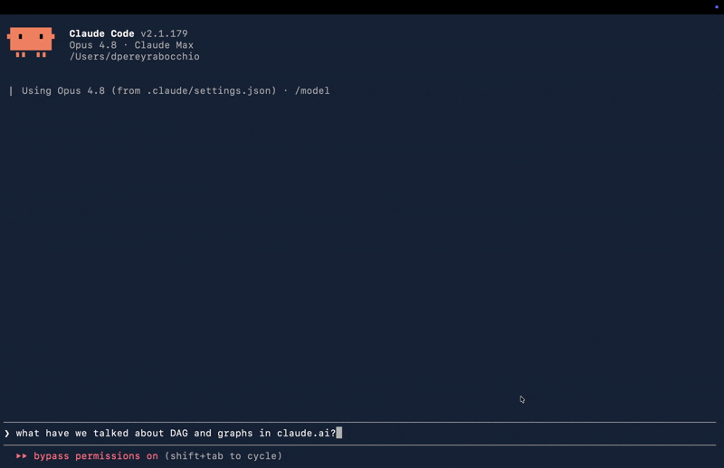

<!-- mcp-name: io.github.dioniipereyraa/memex -->

# Memex

[](https://github.com/dioniipereyraa/memex/actions/workflows/ci.yml)
[](https://opensource.org/licenses/MIT)
[](https://www.python.org/downloads/)

**Your Claude.ai chats and your Claude Code sessions live in two worlds that never talk. Memex makes them one memory you can search from both.**

Local-first MCP server that indexes your Claude.ai chat history and your local Claude Code / terminal sessions, and exposes them to Claude Code (stdio) and Claude.ai (remote MCP connector).

**Status:** alpha, `0.3.1` on PyPI. Phases 0 to 7 closed, security-audited (plus four adversarial red-team rounds). Shipped: hybrid search, live capture, auto-summaries, chat ↔ repo association, the Claude.ai remote connector (GitHub OAuth), Claude Code / terminal ingestion with secret redaction, one-command setup, cross-platform autostart, and one-click claude.ai history backfill.



*End-to-end demo: from Claude Code, you ask about something you discussed on claude.ai. Memex searches your chat history (`search_chats`) and Claude answers from the real conversation. No copy-paste, no manual context handoff.*

## Install

One command installs uv + Memex and runs `memex setup` (registers the MCP server, installs the always-on capture service, indexes your local sessions, prints the pairing token):

```bash
# macOS / Linux
curl -LsSf https://raw.githubusercontent.com/dioniipereyraa/memex/main/scripts/install-pypi.sh | sh
```

```powershell
# Windows (PowerShell)
powershell -ExecutionPolicy ByPass -c "irm https://raw.githubusercontent.com/dioniipereyraa/memex/main/scripts/install-pypi.ps1 | iex"
```

Then the one browser step a terminal cannot do: install the [Chrome extension](#live-capture-phase-2), paste the token it printed, and click "Backfill claude.ai history". Other paths (pipx, `uv tool install`, from source) are under [Installation](#installation).

## The problem

Brainstorming and planning happen in Claude.ai. Execution happens in Claude Code. The two worlds do not talk to each other: Claude Code cannot read a chat of yours from Claude.ai, not even the one that originated the task it is currently working on. The memory Anthropic shipped on Claude.ai (March 2026) is curated, not full history, and lives isolated inside Claude.ai.

Memex fills that gap: runs locally, indexes the entire corpus of your chats, and exposes them as MCP tools so Claude can search and pull past context whenever it needs to.

## How it works

```
[Claude.ai]
    ↓  (official JSON export / Chrome ext)
[Ingestor]  →  [SQLite + sqlite-vec]  →  [local embeddings (fastembed / Ollama)]
                                    ↓
                          [core: storage + retrieval]
                                    ↓
                  [MCP stdio]  ───→  Claude Code, Claude Desktop
                  [MCP Streamable HTTP] ─→ Claude.ai connector
```

Design: pure core (storage, ingest, embeddings, retrieval) decoupled from transport. The same engine serves both stdio and remote MCP without a rewrite.

## Installation

### Quick install (one command)

Installs [uv](https://docs.astral.sh/uv/) if needed (it brings the right
Python), installs Memex from PyPI, and runs `memex setup` to wire it into Claude
Code (MCP server + always-on capture service + local session indexing + the
pairing token). No git clone required.

```bash
# macOS / Linux
curl -LsSf https://raw.githubusercontent.com/dioniipereyraa/memex/main/scripts/install-pypi.sh | sh
```

```powershell
# Windows (PowerShell)
powershell -ExecutionPolicy ByPass -c "irm https://raw.githubusercontent.com/dioniipereyraa/memex/main/scripts/install-pypi.ps1 | iex"
```

The only step a terminal cannot do is the browser one: install the
[Chrome extension](#live-capture-phase-2), paste the token the installer prints,
and click "Backfill claude.ai history" to import your history. Embeddings work
out of the box (a quantized 130 MB [fastembed](https://github.com/qdrant/fastembed)
model downloads on first ingest; no Ollama, no API key).

> A plain `pipx install memex-chats` (or `uv tool install memex-chats`) followed
> by `memex setup` does the same thing in two steps. The autostart service is
> generated for the wheel install too (launchd / systemd / a logon Scheduled
> Task), so no clone is needed for it.

### From source (for development)

Clone the repo to get an editable install plus the extension source and service
templates. You need [git](https://git-scm.com/downloads); the script installs uv
and the pinned Python for you.

### macOS / Linux

```bash
git clone https://github.com/dioniipereyraa/memex
cd memex
./scripts/install.sh
```

`install.sh` installs uv if you do not have it, runs `uv sync`, and verifies
the install with `memex doctor`. That is the whole setup.

### Windows (PowerShell)

```powershell
git clone https://github.com/dioniipereyraa/memex
cd memex
powershell -ExecutionPolicy Bypass -File .\scripts\install.ps1
```

Same three steps as the macOS script (install uv, sync, verify). If git is
not installed, get it from [git-scm.com](https://git-scm.com/downloads) first.

### Manual (any OS, if you prefer explicit steps)

```bash
# 1. Install uv (skip if you already have it):
#    macOS/Linux:  curl -LsSf https://astral.sh/uv/install.sh | sh
#    Windows:      powershell -ExecutionPolicy ByPass -c "irm https://astral.sh/uv/install.ps1 | iex"
git clone https://github.com/dioniipereyraa/memex
cd memex
uv sync               # installs Python 3.13 + dependencies into .venv
uv run memex doctor   # verify
```

### Upgrading (already have memex)

Upgrade with the **same tool that installed it**, or the new version will not land
on your PATH. A previous install owns the `memex` executable, so installing again
with a different manager fails with "Executables already exist" and `memex` keeps
running the old version. (This is the usual reason `memex sync` seems to "not
exist" after an upgrade: an old pipx-owned `memex` shadowed a newer `uv tool`
install.)

```bash
# 1. Find which tool owns it:
which memex            # macOS / Linux
Get-Command memex      # Windows (PowerShell)

# 2. Upgrade with that tool:
pipx upgrade memex-chats        # if pipx owns it
uv tool upgrade memex-chats     # if uv owns it
```

If you want to switch managers, uninstall the old one first (`pipx uninstall
memex-chats` or `uv tool uninstall memex-chats`), then reinstall. After upgrading,
`memex --version` shows the new version and `memex doctor` should pass.

### Multi-device (optional)

To make Claude one memory across several machines, install
[Tailscale](https://tailscale.com) **first** (so each device has a stable private
address), then opt in once per device:

```bash
memex setup --sync     # opt-in, persisted: the always-on service is sync-reachable
```

It prints the single `memex sync connect ...` line to run on your other devices.
The choice is saved, so the service stays sync-reachable across reboots without
re-running anything. Full flow, security model, and the manual one-shot
alternative are in [Syncing across your devices](#syncing-across-your-devices).

## First run

The fast path is one command:

```bash
uv run memex setup
```

`memex setup` wires everything end to end and is safe to re-run: it registers
the MCP server with Claude Code (`claude mcp add`), installs the always-on
live-capture service (launchd on macOS, systemd on Linux, a Scheduled Task on
Windows), indexes your local Claude Code sessions, and prints the access token
to paste into the Chrome extension. Each step degrades to a warning instead of
aborting the rest. Flags: `--no-mcp`, `--no-autostart`, `--no-ingest`,
`--remote` (also install the claude.ai connector agent), `-y` (no prompt).

After that, the only manual step left is installing the
[Chrome extension](#live-capture-phase-2) and pasting the token, so new chats
are captured as you go.

### Manual steps (if you prefer to run them yourself)

```bash
# 1. Request your official Claude.ai export (Settings → Privacy → Export data),
#    then ingest it (first run downloads the embedding model, ~30s):
uv run memex ingest /path/to/your-export.zip

# 2. Optionally index your local Claude Code / terminal sessions:
uv run memex ingest-claude-code

# 3. Search, or wire it into Claude Code (see "Wiring it into Claude Code"):
uv run memex search "your query" -n 5
uv run memex stats
```

(If you installed with a script, the commands above work as written. If you
installed the published PyPI package instead, drop the `uv run` prefix.)

> **Where your data lives.** From a cloned repo, the database and exports stay
> in `<repo>/data`. From a `uvx`/`pip` install, they go to your OS data
> directory (`~/Library/Application Support/memex` on macOS,
> `%LOCALAPPDATA%\memex` on Windows, `~/.local/share/memex` elsewhere). Override
> with `MEMEX_DB_PATH` / `MEMEX_EXPORTS_DIR`. `memex doctor` prints the resolved
> path.

## Embeddings backend

Default is fastembed (zero-config). To route through a local Ollama instead
(e.g. you already run it for other models):

```bash
export MEMEX_EMBED_BACKEND=ollama
ollama pull nomic-embed-text          # install Ollama first: https://ollama.com/download
```

On Windows, install Ollama from [ollama.com/download](https://ollama.com/download)
before setting `MEMEX_EMBED_BACKEND=ollama`. This is optional; fastembed needs
none of it.

## Diagnostics

Run `memex doctor` any time something is not working. It checks Python version, database, embedder, live-capture server, summarizer config, registered repos, and indexed corpus. Reports OK / WARN / FAIL per check.

## Troubleshooting

Start with `memex doctor` (above): most of the issues below also surface there.

**`memex: command not found` right after installing.** The `memex` executable lives in the tool's bin directory, which may not be on your `PATH` in the current shell yet. Open a new terminal, or add it now:
- macOS / Linux: `export PATH="$HOME/.local/bin:$PATH"`
- Windows: re-open the terminal so the installer's PATH change takes effect (the bin dir is `%USERPROFILE%\.local\bin` for `uv tool`, or the pipx Scripts dir).

Then confirm the right binary: `which memex` (macOS/Linux) or `where memex` (Windows). It should point at the uv-tool / pipx install, not an old clone.

**The extension shows the server as not responding, or ingest returns `401`.**
- Is the server up? `curl -s http://127.0.0.1:5777/health` should return JSON. If it does not, start it (`memex serve`) or check the autostart service below.
- `401` means the pairing token is missing or stale: run `memex token`, copy the value, paste it into the extension popup, and click **Save token**.

**The autostart service did not come up.** Check its status, then read its log:
- **Linux**: `systemctl --user status memex-serve`; log at `~/.local/share/memex/serve.log`. `Failed to connect to bus` means there is no user systemd manager for this session (common over plain SSH): run `loginctl enable-linger "$USER"`, make sure `XDG_RUNTIME_DIR=/run/user/$(id -u)` is set, then re-run `memex install-service`.
- **macOS**: `launchctl list | grep memex`; log in the data dir (`~/Library/Application Support/memex/com.memex.serve.log` on a PyPI install, `<repo>/data/serve.log` from source).
- **Windows**: Task Scheduler, or `schtasks /Query /TN MemexServe /V`; log at `%LOCALAPPDATA%\memex\serve.log`. If an older install left a task with the same name, it can silently mask the new one: delete it (`schtasks /Delete /TN MemexServe /F`) and re-run `memex install-service`.

**Autostart does not survive logout or reboot (Linux).** A systemd *user* unit is torn down when your session ends unless lingering is enabled: `loginctl enable-linger "$USER"`.

**The one-command installer fails with a shell error.** The installer is POSIX `sh`. If you are on a very old or unusual shell and the pipe fails, fetch and run it with bash instead: `curl -LsSf <url>/install-pypi.sh | bash`.

**The first backfill (or first ingest) is slow.** The first embed downloads a ~130 MB quantized model; that is one-time, later runs are fast. The backfill is incremental and safe to re-run, so a slow or interrupted first pass simply resumes where it left off.

**Ingest uses too much memory.** Peak RAM scales with the embed batch size. Lower it: set `MEMEX_EMBED_BATCH_SIZE=1` (about 0.67 GB peak) in your environment or `.env`.

**Where is my data?** `memex doctor` prints the DB path. By default it is `~/.local/share/memex` (Linux), `~/Library/Application Support/memex` (macOS), or `%LOCALAPPDATA%\memex` (Windows) for a PyPI install, or `<repo>/data` from a clone. Override with `MEMEX_DB_PATH` / `MEMEX_EXPORTS_DIR`.

## MCP server tools (v1)

- `search_chats(query, limit=5, source?, mode="hybrid", repo?)` searches the corpus. Modes: `hybrid` (default, combines vector search + FTS5 BM25 via Reciprocal Rank Fusion), `semantic` (vectors only), `lexical` (FTS5 only, ideal for proper nouns or exact terms). `source` filters by origin (`conversations`, `design_chat`, `memory`). `repo` boosts results associated to a registered repo (see "Repo associations" below). Deduplicated per conversation.
- `get_chat(uuid, messages_limit=10, messages_offset=0)` fetches a conversation with its messages, paginated. `raw_content` is omitted; each message is truncated to 1500 chars to stay inside the client's token budget (worst-case response ~17k chars). Long chats are paginated with `messages_offset`; max `messages_limit` is 100.
- `list_recent_chats(limit=10, source?)` lists the latest chats ordered by last update.
- `find_related(context, limit=5, repo?)` takes free-form text (a paragraph, a file contents, the current discussion) and returns chats that are semantically related. Pure vector search, no FTS, capped at 4000 input chars. Useful when you want "more like this" without typing a keyword query.

Search is also reachable from the CLI with `memex search "query" --mode {hybrid|semantic|lexical}`. For databases created before the hybrid FTS5 work, run `memex reindex-fts` once to populate the lexical index.

## Wiring it into Claude Code

Once your local database is populated (`memex ingest`), start the MCP server with `uv run memex-mcp`. For Claude Code to discover it automatically, add a `.mcp.json` file at the root of your project (or a user-level server in `~/.claude.json`):

```json
{
  "mcpServers": {
    "memex": {
      "command": "uv",
      "args": ["run", "memex-mcp"],
      "cwd": "/absolute/path/to/the/memex/repo"
    }
  }
}
```

Set `cwd` to the absolute path where you cloned Memex (where `pyproject.toml` lives). Restart Claude Code and the tools `search_chats`, `get_chat`, `list_recent_chats` will show up in the session.

The same searches are also available from the CLI via `uv run memex search "..."` if you prefer them outside Claude Code.

## Connecting from claude.ai (remote MCP, Phase 4)

`memex serve-remote` exposes the same 4 tools as a [custom connector](https://support.claude.com/en/articles/11175166-get-started-with-custom-connectors-using-remote-mcp) for claude.ai. One connector works across claude.ai web, Claude Desktop, and the mobile apps: the connection is brokered by your Claude account and always originates from Anthropic's cloud, never from your device. That has two consequences:

1. The server must be reachable on a **public HTTPS URL** (a hostname with a public IPv4 `A` record; `localhost` and private IPs are rejected by design). The intended setup is a tunnel that terminates TLS and proxies to Memex on loopback.
2. Auth is either *none* or *full OAuth 2.0* (claude.ai has no field to paste a token). Memex uses OAuth backed by a GitHub OAuth App, restricted to an allow-list of GitHub usernames: anyone else who completes the OAuth dance still gets a 401 on every request. Your machine must be on (and the tunnel up) for the connector to respond.

### 1. Publish a URL with Tailscale Funnel

Install [Tailscale](https://tailscale.com/download), log in, then:

```bash
tailscale funnel --bg 8377
```

This prints your public URL, e.g. `https://my-mac.my-tailnet.ts.net`, TLS included. Any other tunnel works the same way (ngrok, Cloudflare Tunnel); Memex only needs the resulting `https://` URL.

### 2. Create a GitHub OAuth App

At [github.com/settings/developers](https://github.com/settings/developers) > OAuth Apps > New OAuth App:

- Homepage URL: your funnel URL.
- Authorization callback URL: `<funnel URL>/auth/callback`.

Copy the Client ID and generate a Client Secret.

### 3. Configure and run

In `.env` (see `.env.example`):

```bash
MEMEX_REMOTE_BASE_URL=https://my-mac.my-tailnet.ts.net
MEMEX_GITHUB_CLIENT_ID=Iv1.xxxxxxxxxxxx
MEMEX_GITHUB_CLIENT_SECRET=xxxxxxxxxxxxxxxxxxxx
MEMEX_REMOTE_ALLOWED_GITHUB_LOGINS=your-github-username
```

```bash
uv run memex serve-remote   # listens on 127.0.0.1:8377, endpoint at /mcp
```

The server refuses to start with incomplete config (no insecure defaults: an empty allow-list would expose your whole chat history to any GitHub account).

### 4. Add the connector in claude.ai

Settings > Connectors > Add custom connector, with URL `https://my-mac.my-tailnet.ts.net/mcp`. claude.ai registers itself via dynamic client registration, sends you through the GitHub authorization, and the tools appear in your chats. OAuth state is persisted encrypted on disk, so restarting `serve-remote` does not break the connection.

Security model in short: loopback bind + tunnel, OAuth proxy over GitHub with a username allow-list enforced on **every** request (revoking the app on GitHub locks it out immediately), `TrustedHostMiddleware` pinned to the public hostname, and the same indirect-prompt-injection envelope on tool results as the stdio transport.

## Indexing Claude Code / terminal sessions (Phase 6)

Memex also indexes your local Claude Code and terminal sessions, so a single search covers both halves of your history: what you discussed on claude.ai and what you built with Claude Code. Claude Code records each session as a JSONL file under `~/.claude/projects/`; Memex reads them directly (no extension, no network).

```bash
uv run memex ingest-claude-code        # scans ~/.claude/projects/**/*.jsonl
uv run memex ingest-claude-code --path /custom/path   # alternate root
```

These sessions are stored under the `claude_code` source, searchable like any other chat (and filterable with `source="claude_code"`). Details:

- **Incremental.** Unchanged sessions are skipped (by content hash), so re-running after more work is cheap. Sessions grow append-only, so a re-scan picks up new turns and new sessions. Re-run it whenever you want to refresh, or wire it to a schedule.
- **Repo-aware for free.** Every session carries its working directory, so each is auto-associated with the registered repo of that `cwd` (run `memex repos add <path>` first). `search_chats(repo=...)` then boosts the sessions where you worked on that project.
- **What is indexed:** your prompts, the assistant replies, and tool calls as `[tool_use: ...]` / `[result]` markers. Excluded: assistant internal reasoning (`thinking`), parallel sub-agent side threads, and CLI plumbing (slash-command echoes, bash wrappers). Everything stays in the local SQLite DB.
- **Secret redaction.** Session logs capture real terminal output and file contents, which often contain credentials. Before storing, Memex masks common secret shapes (API keys, bearer/JWT tokens, PEM private keys, `KEY=`/`SECRET=` assignments, URLs with embedded passwords) as `[REDACTED:...]`, and does not persist the raw block content for this source. Best-effort, not a guarantee: it catches well-known formats so third-party credentials that were never really part of a conversation stay out of the index (this matters because the remote connector can surface indexed text to claude.ai).

### Automatic sync (keep Claude Code sessions fresh)

`memex ingest-claude-code` is manual. To index sessions automatically, use two complementary mechanisms (both run in the background at low priority, and the embedding model only loads when there is something new, so they barely cost anything):

1. **SessionEnd hook** — ingests a session the moment it closes (no delay, nothing lost). Add to `~/.claude/settings.json`:
   ```json
   {
     "hooks": {
       "SessionEnd": [
         { "matcher": "*", "hooks": [
           { "type": "command", "command": "/absolute/path/to/memex/scripts/session-end-hook.sh" }
         ] }
       ]
     }
   }
   ```
   The hook reads the closed session's `transcript_path` and ingests just that one session, detached, returning immediately (SessionEnd hooks cannot block Claude Code).

2. **Periodic backstop** — a scheduled scan that catches anything the hook missed (e.g. a crash). On macOS, with launchd:
   ```bash
   sed "s|__REPO__|$(pwd)|g" scripts/com.memex.ingest-claude-code.plist.template \
     > ~/Library/LaunchAgents/com.memex.ingest-claude-code.plist
   launchctl load ~/Library/LaunchAgents/com.memex.ingest-claude-code.plist
   ```
   It runs `scripts/scheduled-ingest.sh` every 15 minutes as a low-priority background job. On Linux, run the same script from a systemd user timer or cron; the script is OS-agnostic. (On Windows, the hook needs a PowerShell equivalent of `session-end-hook.sh`, not yet included; until then, schedule `memex ingest-claude-code` with Task Scheduler.)

## Syncing across your devices

If you run memex on more than one machine (say a laptop and a desktop), `memex
sync` makes Claude one memory across them: index a chat on one device and search
it from the other. Each device keeps its own local store and they sync
peer-to-peer, with no central server and nothing leaving your hardware. The sync
needs both devices powered on and reachable at the same time (it is overlap
sync, not a cloud relay). It ships in memex `0.4.0`+; on an older install,
upgrade first (`uv tool upgrade memex-chats`).

The whole feature is **off by default** and exposes nothing until you turn it on.
While it is off, the sync endpoints return 404 and the sync commands refuse, so a
normal single-device install has no extra surface.

### Set it up once (recommended)

Install [Tailscale](https://tailscale.com) on each device first, then opt in once:

```bash
memex setup --sync
```

This is the normal setup plus one thing: it turns sync on and makes your
**always-on capture service** sync-reachable on this device's Tailscale address
(it binds `0.0.0.0` so one server still answers the local extension, with the Host
allow-list pinned to loopback + your Tailscale IP, resolved at startup, and the
per-install token gating access). The choice is **persisted**: set it once and the
service comes up sync-reachable on every reboot, so you never hand-run a serve
command. It prints the single line to run on each other device:

```bash
memex sync connect --url http://100.x.y.z:5777 --token <TOKEN> --name my-mac
```

`connect` turns sync on there, pairs, and runs a two-way reconcile, so that device
is set up and caught up in one step. Later, `memex sync reconcile` re-syncs an
already-paired device and `memex sync status` shows what is paired. Turn the
exposure back off with `memex setup --no-sync` (it stays loopback-only, sync off).

### One-shot (without changing your setup)

If you would rather not make the service permanently reachable, start a temporary
endpoint on the device that has the conversations:

```bash
# SOURCE device:
memex sync serve
# -> Memex sync serve reachable at http://100.x.y.z:5777
#    On the other device, run this one command:
#      memex sync connect --url http://100.x.y.z:5777 --token <TOKEN> --name my-mac
```

`memex sync serve` works the same on macOS, Linux, and Windows (it uses your
Tailscale address, so there is no per-OS network setup and no `--host`/allow-list
juggling). If you are not on Tailscale, pass `--host <address the other device can
reach>`. It binds to that address only and runs alongside your loopback capture
server without a port clash; keep it up while the other device connects, then stop
it with Ctrl+C. Afterwards, `memex sync reconcile` re-syncs an already-paired device.

`reconcile` is the usual command: it syncs both ways and converges the two
devices, keeping the newer copy of anything that exists on both (last writer wins
by update time). If the same conversation was edited on both devices with the
exact same timestamp, that is a conflict: `reconcile` leaves both copies
untouched and reports it, and you pick a winner with a one-directional `memex sync
pull --peer mac` (take the peer's) or `push --peer mac` (send yours).

Every sync only transfers conversations that are new or changed, brings their
embeddings along so your machine never re-embeds, and is idempotent (re-running
moves nothing new). A large history transfers in size-bounded batches
automatically, so it works no matter how many conversations you have (tune the
target with `MEMEX_SYNC_MAX_BATCH_BYTES`, default 8 MB; a single conversation
larger than the peer's `MEMEX_INGEST_MAX_BODY_BYTES` is skipped with a clear
message). Both devices must use the same embedding model (the sync refuses on a
mismatch). The peer's token is stored user-only (0600) next to the DB. Pairing is
a trust decision (it shares an access token), so only pair devices you control.
Never sync the SQLite file itself with a folder-sync tool; always use `memex
sync`, which is consistent at the conversation level.

To keep two devices in sync automatically, set `MEMEX_SYNC_AUTO=true` before
`memex serve`: while sync is enabled it reconciles with each paired peer on
startup and every `MEMEX_SYNC_INTERVAL_SECONDS` (default 900), skipping a peer
that is offline and backing off while an ingest is running. It stays off unless
you both set the flag and `enable` sync. Turn the whole feature back off any time
with `memex sync disable`.

## Running always-on

`memex serve` (claude.ai capture) is a long-lived server, and the Claude Code
ingest backstop runs on a schedule. To have them start on login and stay up
(restarting if they crash), let `memex setup` install the service, or call it
directly on any OS:

```bash
memex install-service            # install (launchd / systemd / Scheduled Task)
memex install-service status     # show what is registered
memex install-service uninstall  # remove it
```

This is cross-platform: launchd agents on macOS, a systemd user unit on Linux,
a Scheduled Task on Windows. By default it manages the live-capture server plus
the 15-minute Claude Code ingest backstop. Idle cost is low: neither loads the
embedding model until there is real work. It works the same from a PyPI / pipx /
`uv tool` install (a self-contained launchd / systemd / Scheduled Task that runs
the installed `memex serve` directly) and from a cloned repo. Use a persistent
install (`pipx` or `uv tool`), not transient `uvx`, so the service has a stable
interpreter to launch at boot.

To also run the claude.ai remote connector as a service, pass `--remote`
(macOS): `memex install-service --remote`. It only makes sense once the
`MEMEX_REMOTE_*` config is in `.env` and the Tailscale Funnel is up on the same
port (`tailscale funnel --bg 8377`), otherwise the agent crash-loops; that is
why it is opt-in.

<details>
<summary>Manual launchd setup (macOS, if you prefer explicit steps)</summary>

```bash
cd /path/to/memex
for svc in serve ingest-claude-code; do
  sed "s|__REPO__|$(pwd)|g" "scripts/com.memex.$svc.plist.template" \
    > ~/Library/LaunchAgents/com.memex.$svc.plist
  launchctl load ~/Library/LaunchAgents/com.memex.$svc.plist
done
launchctl list | grep memex
```

To stop a service: `launchctl unload ~/Library/LaunchAgents/com.memex.<name>.plist`.
</details>

## Auto-summaries (Phase 3, optional)

When `search_chats` returns a chat that does not have a summary yet, Memex can generate one on-the-fly using Claude Haiku. The summary is persisted, so the next search of the same chat hits cache and does not pay the API again. This way you only pay for chats you actually look at, not for the whole corpus.

Opt-in. Off by default. Cap: at most 3 summaries generated per `search_chats` call (parallel), to bound latency and per-query cost.

1. Install the extra (adds the `anthropic` SDK):
   ```bash
   uv sync --extra summaries
   ```
2. In your `.env` (or as env vars), set:
   ```bash
   ANTHROPIC_API_KEY=sk-ant-...
   MEMEX_SUMMARY_ENABLED=true
   ```
3. Use `search_chats` from Claude Code as usual. The first time a chat appears in results without a cached summary, Memex generates one. Subsequent searches return the cached summary instantly.

Configurable via env: `MEMEX_SUMMARY_MODEL` (default `claude-haiku-4-5-20251001`), `MEMEX_SUMMARY_MAX_TOKENS` (default 200). If the API fails for a particular chat (no key, rate limit, network), that one result comes back without a summary, the search itself never aborts, and the warning is logged.

Cost model: bulk ingest of an export with 74 chats costs $0 (no summaries are generated at ingest time). Each unique chat you actually open in a search costs roughly $0.01 (Haiku, ~5-10k input + ~200 output tokens). $5 of API credits comfortably covers months of use.

## Repo associations (Phase 3)

Memex can associate each chat with the local code repos it touches, and boost those chats when `search_chats` is invoked from inside a repo. So when you ask Claude Code something like "remember the auth refactor we discussed?", chats that touched the *current* repo rank higher than unrelated chats with the same keywords.

How it works:

1. Register a repo:
   ```bash
   uv run memex repos add /path/to/your/repo
   ```
   Memex reads `.git/config` (origin URL), and `pyproject.toml` / `package.json` / `Cargo.toml` (package name). The canonical key prefers the git remote (stable across clones) over the path.

2. Run a one-time scan over chats you already ingested:
   ```bash
   uv run memex repos scan
   ```
   Each chat gets matched against every registered repo. The matcher uses 4 signals (highest wins): remote URL literal in chat text (confidence 1.0), absolute path literal (0.9), manifest name word-bounded (0.8), display name word-bounded (0.5). Anything below 0.5 is dropped. New chats ingested after registering the repo are auto-scanned at ingest time.

3. From Claude Code, search with the repo argument:
   ```text
   search_chats(query="auth refactor", repo="d:/dionisio/memex")
   ```
   Or pass the git remote URL, or the canonical key from `memex repos list`. Chats associated to the repo get their distance reduced by `0.3 * confidence`. Chats outside the repo still appear lower down (it is a boost, not a filter).

CLI helpers:

```bash
uv run memex repos list           # show registered repos
uv run memex repos remove <key>   # unregister + cascade-remove associations
uv run memex tag <chat-uuid> <repo-key>    # manual override (sticky vs auto-scan)
uv run memex untag <chat-uuid> <repo-key>  # remove an association
```

A `manual` tag survives subsequent auto-scans: once you tag a chat by hand, the matcher will not overwrite it.

### Proactive context injection (`SessionStart` hook)

Claude Code supports hooks that run shell commands at session boundaries. Memex ships `memex session-context`, designed to be wired into the `SessionStart` hook so every new Claude Code session in a registered repo starts with a Markdown blob listing the most relevant past chats. No query needed.

To enable it, add to your `.claude/settings.json` (project-local) or `~/.claude/settings.json` (user-global):

```json
{
  "hooks": {
    "SessionStart": [{
      "command": "uv run memex session-context"
    }]
  }
}
```

The command auto-detects the active repo by walking up from `cwd` until it finds `.git`. If the repo is registered in Memex and has associated chats, it prints a short Markdown blob with the top N (default 5) chats, ordered by `manual` first, then `auto` by confidence. If anything fails (no `.git`, repo not registered, no associations), it prints nothing on stdout (only diagnostics on stderr), so the hook is a silent no-op in that case.

You can also run the command by hand to debug: `uv run memex session-context [--repo <path>] [--limit N]`.

## Live capture (Phase 2)

So that new Claude.ai chats land in Memex without asking for a manual export:

1. **Start the local HTTP server** in a terminal:
   ```powershell
   uv run memex serve
   ```
   Listens on `127.0.0.1:5777` by default. Keep it running while you browse claude.ai. On start it prints an **access token**; the extension must send it (the loopback Origin check alone does not authenticate other local processes). Reprint it any time with `uv run memex token`.

2. **Load the Chrome extension**:
   - Soon: install from the [Chrome Web Store](https://chrome.google.com/webstore/devconsole) (in review for the alpha).
   - For now (unpacked load):
     - Open `chrome://extensions/`
     - Enable **Developer mode**
     - **Load unpacked** → pick `chrome-extension/` from the repo
     - Click the Memex icon and confirm the "Server" chip says **responding** (green).

3. **Pair the extension with the access token.** Run `uv run memex token`, copy the value, paste it into the extension popup's token field, and click **Save token**. This is a one-time step per machine (the token lives user-only next to your DB). Without it, ingest requests are rejected with `401`.

4. **Import your full history (one click).** With a claude.ai tab open, click **Backfill claude.ai history** in the popup. It pages through your entire chat list and pulls every conversation into Memex, skipping the ones already indexed and unchanged (so re-running is cheap and a closed tab just resumes on the next click). Progress shows in the popup. This is what makes a fresh install searchable without a manual export.

5. **Then just use claude.ai.** Every new chat you open or create is ingested automatically. Verify with `memex stats` or by calling `search_chats` from Claude Code.

Details in [chrome-extension/README.md](chrome-extension/README.md).

#### Autostart (macOS + Windows + Linux)

So you do not have to run `memex serve` by hand every time you log in (this is also what `memex setup` does for you):

```bash
memex install-service          # default action: install
memex install-service status   # check current state
memex install-service uninstall
```

The CLI dispatches to the right installer for your OS:

- **macOS**: writes launchd agents for `serve` + the 15-minute Claude Code ingest backstop, and `launchctl load`s them. Logs in the data dir (`<repo>/data/serve.log` from a clone, `~/Library/Application Support/memex/com.memex.serve.log` from a PyPI install). Add `--remote` to also run the claude.ai connector (needs the `MEMEX_REMOTE_*` config). See [Running always-on](#running-always-on).
- **Windows**: registers a Scheduled Task (`MemexServe`) that runs `memex serve` at logon. No admin required, no console window, survives VS Code close. Logs at `%LOCALAPPDATA%\memex\serve.log`. Auto-restarts up to 3 times if it dies.
- **Linux**: writes a systemd user unit at `~/.config/systemd/user/memex-serve.service`, enables it, and starts it now. Logs at `~/.local/share/memex/serve.log`. To keep it running across logout: `loginctl enable-linger $USER`. Status: `systemctl --user status memex-serve`.

From a `pip`/`pipx` install (no cloned repo), `memex install-service` works on macOS, Linux, and Windows alike: it generates a self-contained agent (launchd / systemd / a logon Scheduled Task) that runs the installed `memex serve` directly, with the database in your per-user data directory. Use `pipx` (not transient `uvx`) so the service has a stable interpreter to launch at boot.

### Making Claude use Memex proactively

By default, LLMs are conservative with tools: they prefer to ask before invoking anything. If you say *"remember we talked about X?"*, Claude tends to answer *"I don't recall"* instead of searching.

The docstrings of the 4 tools already include "USE PROACTIVELY" instructions, but you can reinforce it by adding this snippet to your `CLAUDE.md` (global at `~/.claude/CLAUDE.md` for every session, or local at `<project>/CLAUDE.md` for a specific one):

```markdown
## Memex: persistent memory of Claude.ai chats

There is an MCP server `memex` with 4 tools: `search_chats`, `get_chat`, `list_recent_chats`, `find_related`.
They index ALL of the user's Claude.ai history, reachable via hybrid search
(semantic + lexical FTS5).

**Operational rule:** before answering "I have no record", "I don't remember", "this is
the first time I hear about this", or anything equivalent, call `mcp__memex__search_chats`
with the relevant query. Claude Code's native memory starts clean every session; Memex
is the only path into the user's real history.

Typical triggers: "remember when...", "did I tell you about...", "we already talked about...",
"the other day we discussed...", or any reference to a project / person / decision that might
live in history.
```

## Roadmap

See [ROADMAP.md](ROADMAP.md) for phases, close criteria, and current status (in Spanish, it is the internal journal).

## Devlog

See [DEVLOG.md](DEVLOG.md) for the log of decisions, blockers, and progress (in Spanish).

## Inspiration and references

- Official feature request: [anthropics/claude-code#12858](https://github.com/anthropics/claude-code/issues/12858)
- [Claude Historian](https://mcpmarket.com/server/claude-historian), [claude-conversation-extractor](https://github.com/ZeroSumQuant/claude-conversation-extractor): MCP servers for Claude Code / Desktop history. Reference for tool structure.
- [claude-conversation-export](https://github.com/Emnolope/claude-conversation-export): Claude.ai exporter using the same capture strategy. Useful as backfill.
- Spin-off of the [SyncChat](https://github.com/dionipereyrab/SyncChat) project.

## License

MIT.
